Claude finished the response
I have robotics exam. Help me prepare for the xm. In the xm there will be 5 scenario based questions using the robots- Garbage Collection Robot Earthquake Monitoring and Evacuation Robot Robotic Arm / Robotic Manipulator Nursing Assistant Robot Firefighting Robot. Give me question and answers from this robots. Topics to cover- 1. Embedded Systems: Sensors and their applications Integration of sensors and actuators in robotic systems 2. Flow Diagrams: Functionality based work flow Control flow, state transitions 3. Pseudocode 4. Robotics Mathematics and Mechanics: Coordinate Geometry Forward Kinematics (FK) Inverse Kinematics (IK) Torque calculations and analysis 5. Vision Sensors: Common challenges in robot vision systems Techniques for improving detection, recognition, and navigation. Example- SLAM Problem-solving approaches for vision-based applications 6. Control Systems: Feedback control concepts and PID (Proportional–Integral–Derivative) controllers Controller tuning and performance analysis 7. Communication Protocols Points to be noted: Students should focus on both theoretical concepts and practical applications related to each robot type and topic area. All diagrams should have captions. A brief explanation before the diagram. Also arrowing and block transitions should be carefully followed. Pseudo code should have start, initialization, and all functions mentioned in the scenario.

Show more
12:19 AM

Crafting comprehensive markdown document with meticulous syntax
Crafting comprehensive markdown document with meticulous syntax
I'll quickly check the skill conventions, then build you a complete study document with proper flow diagrams, state diagrams, pseudocode, and worked math for all 5 robots.


Architected comprehensive robotics exam guide spanning sensors, kinematics, vision, control systems
Architected comprehensive robotics exam guide spanning sensors, kinematics, vision, control systems
No markdown skill needed — I'll build a clean markdown study guide with rendered mermaid diagrams. Writing it now.


Orchestrated comprehensive robotics exam preparation framework
Orchestrated comprehensive robotics exam preparation framework
Done. The guide covers all 5 robots across all 7 topic areas, in the format your exam wants — each diagram has a one-line intro, the diagram itself, and a caption, with every arrow and state transition labeled.

How it's built:

Per robot: scenario → sensors/actuators/integration → functionality flowchart → state-transition diagram → pseudocode (BEGIN → INITIALIZE → functions → main loop) → math/mechanics → vision/SLAM → PID control → communication.
FK/IK/torque is fully worked under the Robotic Arm (with a verified numerical example), and torque also appears as incline-climbing (Firefighting) and gripper lift (Garbage).
A topic ↔ robot map at the top predicts which topic is easiest to score on which robot, and a cheat sheet at the end has every formula, a sensor table, a protocol table, and Ziegler–Nichols tuning.
The mermaid diagrams render in the Claude app; if you download the .md, view it in any Mermaid-aware viewer (or paste blocks into mermaid.live) to see them drawn. The source also reads as plain flow logic, so it's usable either way.

Two things I can do next if useful: convert this to a printable PDF (diagrams pre-rendered so they show up offline), or write 5 full mock exam questions (one scenario each) with model answers so you can self-test under time. Want either?


Robotics exam prep
Document · MD 

Next time, try this in Cowork

Hand off complex tasks for Claude to handle independently. Come back to finished results.


Claude is AI and can make mistakes. Please double-check responses.


raw
Robotics exam prep · MD
# Robotics Exam — Scenario-Based Q&A Prep
 
**Robots covered:** Garbage Collection · Earthquake Monitoring & Evacuation · Robotic Arm / Manipulator · Nursing Assistant · Firefighting
**Topics covered:** Embedded Systems · Flow Diagrams · Pseudocode · Robotics Math & Mechanics (Coordinate Geometry, FK, IK, Torque) · Vision (SLAM) · Control Systems (PID) · Communication Protocols
 
> The exam has 5 scenario questions, likely one per robot. You won't know which topic gets attached to which robot, so this guide gives a full answer for **every topic on every robot**. Diagrams render in the Claude app / any Mermaid viewer; the source is also readable as plain logic.
 
---
 
## How to use this + exam strategy
 
1. **Read the scenario, identify the topic asked.** Each topic has a standard answer skeleton — reuse it and swap in robot-specific sensors/math.
2. **Always draw the diagram with: a one-line intro → the diagram → a caption.** Label every arrow (Yes/No on decisions, event names on state transitions). Examiners give marks for clean arrowing.
3. **Pseudocode pattern (every time):** `BEGIN → INITIALIZE sensors/actuators/variables → define FUNCTIONS → main WHILE loop calling those functions → END`.
4. **For math, write the formula, plug numbers, box the answer, state units.**
### Topic ↔ Robot strength map (where each topic is most likely / easiest to score)
 
| Topic | Strongest robot(s) | Why |
|---|---|---|
| FK / IK | **Robotic Arm** | Multi-DOF joints, the textbook case |
| Torque | Robotic Arm, Firefighting (incline), Garbage (gripper) | Lifting loads / climbing |
| SLAM / Vision | Garbage, Nursing, Firefighting | Navigation in real environments |
| Seismic / threshold sensing | **Earthquake** | Accelerometer + gas sensing |
| PID | All (Arm = joint, mobile = heading/speed) | Feedback everywhere |
| Communication (real-time) | Robotic Arm (CAN/EtherCAT) | Deterministic joint control |
| Communication (long-range) | Earthquake, Firefighting | LoRa/cellular when infra fails |
| Safety control | Nursing, Firefighting | Humans nearby / hazardous |
 
---
 
## Common Concept: Sensor–Actuator Integration & the Feedback Loop
 
Every robot here follows the same control architecture: **sensors** sense the world → a **controller** (microcontroller / single-board computer) processes the data and decides → **actuators** act on the world → the result is sensed again, closing the loop. Low-level, fast tasks (motor PWM, reading encoders) run on a microcontroller (Arduino/STM32); heavy tasks (vision, SLAM, planning) run on an SBC (Raspberry Pi / Jetson Nano).
 
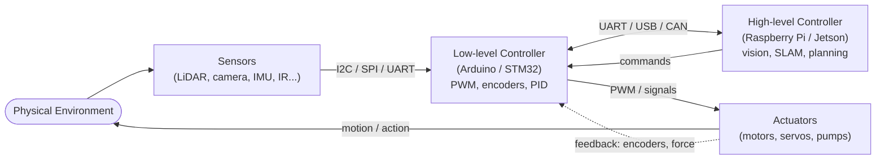
 
*Figure 0: Generic sensor → controller → actuator architecture with feedback. The dashed line is the feedback path (encoders/force) that makes closed-loop control possible. Reuse this skeleton for any robot and just swap the sensor/actuator names.*
 
**Feedback control in one line:** the controller compares a *measured* value with a *desired* value, computes the **error**, and drives the actuator to shrink that error to zero.
 
---
 
# 1. Garbage Collection Robot
 
**Scenario:** An autonomous wheeled robot patrols a campus/street, detects litter using a camera, navigates to it while avoiding obstacles, picks it up with a gripper, drops it into an onboard bin, and empties the bin at a dumping station when full.
 
## Q1.1 — Embedded Systems: sensors, actuators, and their integration
 
**Sensors and their applications:**
 
- **RGB Camera** — detects and classifies garbage (paper, can, bottle) via a CNN object detector.
- **LiDAR** — builds a 2D/3D map and supports SLAM for navigation.
- **Ultrasonic (HC-SR04)** — short-range obstacle distance and gap detection.
- **IR sensors** — cliff/edge detection (don't fall off a kerb) and line following.
- **GPS** — coarse outdoor localization.
- **IMU (accelerometer + gyroscope)** — orientation and dead-reckoning (odometry).
- **Wheel encoders** — measure wheel rotation → distance and speed feedback.
- **Load cell (weight sensor)** in the bin — detects when the bin is full.
**Actuators:**
 
- **DC geared motors + motor driver (L298N / BTS7960)** — differential-drive locomotion.
- **Servo-driven gripper / small arm** — picks up the litter.
- **Linear actuator** — tilts/dumps the bin at the station.
**Integration:** The camera and LiDAR feed the SBC (vision + SLAM). The SBC sends a target (x, y) to the Arduino, which runs PID on the wheel motors using encoder feedback and reads ultrasonic/IR for last-metre safety. Encoder + IMU + LiDAR data are **fused** (e.g., Kalman filter) for reliable localization.
 
## Q1.2 — Functionality-based workflow (flow diagram)
 
The robot loops through: scan → detect → navigate → pick → store → check bin. The decision diamonds branch on "garbage detected?" and "bin full?".
 
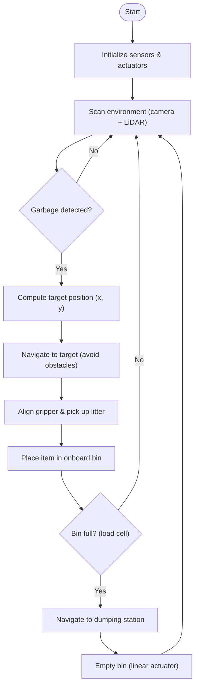
 
*Figure 1.1: Functional workflow of the garbage collection robot. Two decision points control the cycle — detection keeps it scanning, and the bin-full check sends it to dump before resuming.*
 
## Q1.3 — Control flow / state transitions
 
At a higher level the robot is a finite-state machine. Events (garbage found, bin full, low battery) trigger transitions.
 
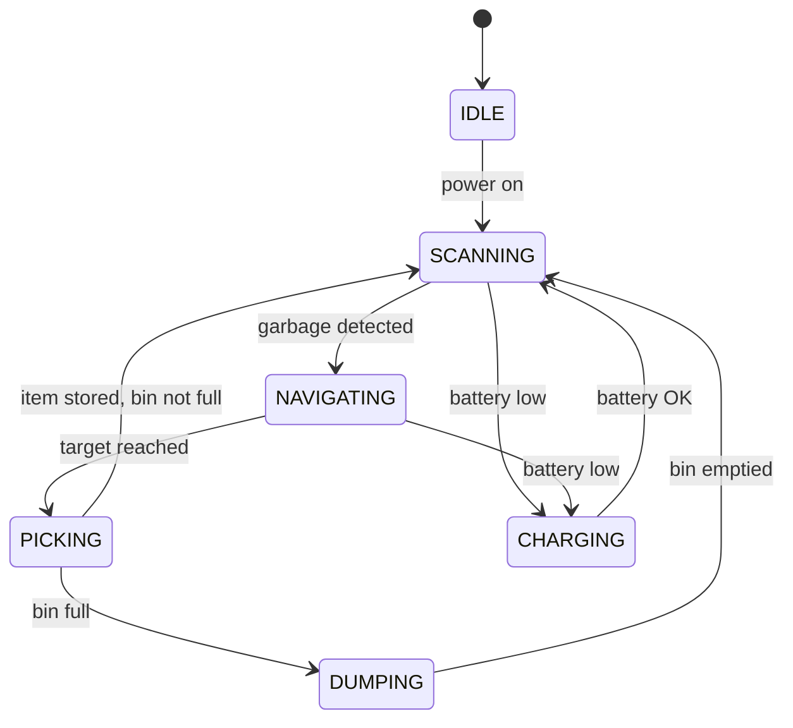
 
*Figure 1.2: State-transition diagram. CHARGING is reachable from working states on a low-battery event and returns control to SCANNING once recharged.*
 
## Q1.4 — Pseudocode
 
```text
BEGIN GarbageCollectionRobot
 
    INITIALIZE sensors  = {camera, lidar, ultrasonic, IR, gps, imu, encoders, loadCell}
    INITIALIZE actuators = {driveMotors, gripperServo, dumpActuator}
    SET state    = IDLE
    SET binFull  = FALSE
 
    FUNCTION scanEnvironment():
        frame = camera.capture()
        objects = detectGarbage(frame)      // CNN
        RETURN objects
 
    FUNCTION detectGarbage(frame):
        RETURN CNN.classify(frame, class = "litter")
 
    FUNCTION navigateTo(target):
        WHILE distanceTo(target) > tolerance:
            avoidObstacles(ultrasonic, lidar)
            error   = headingError(target)
            speed   = PID(error)            // heading control
            driveMotors.set(speed)
 
    FUNCTION pickUp():
        gripperServo.open()
        approachItem()
        gripperServo.close()
 
    FUNCTION dumpBin():
        navigateTo(DUMP_STATION)
        dumpActuator.extend()
        dumpActuator.retract()
        binFull = FALSE
 
    // ---------- main loop ----------
    state = SCANNING
    WHILE robotIsOn():
        objects = scanEnvironment()
        IF objects is not empty THEN
            target = objects[0].position
            navigateTo(target)
            pickUp()
            IF loadCell.read() >= FULL_THRESHOLD THEN
                binFull = TRUE
        IF binFull THEN
            dumpBin()
        IF battery.level() < LOW THEN
            goCharge()
 
END
```
 
## Q1.5 — Robotics Math & Mechanics
 
This is a **mobile robot**, so its "forward kinematics" is differential-drive odometry, and coordinate geometry handles target-seeking. (FK/IK of a multi-joint arm is covered fully under the Robotic Arm.)
 
**Coordinate geometry (target seeking).** Robot at `(xr, yr, θ)`, litter at `(xt, yt)`:
 
- Distance to target: `d = √((xt − xr)² + (yt − yr)²)`
- Desired heading: `θ_target = atan2(yt − yr, xt − xr)`
- Heading error (drives the PID): `e = θ_target − θ`
**Differential-drive forward kinematics** (left/right wheel speeds `vL, vR`, wheelbase `L`):
 
```
v = (vR + vL) / 2          (linear speed)
ω = (vR − vL) / L          (angular speed)
ẋ = v·cos θ,  ẏ = v·sin θ,  θ̇ = ω
```
 
**Torque (gripper lifting litter).** To hold a litter of mass `m` at the gripper, arm length `Larm` horizontal:
 
```
τ = m · g · Larm
Example: m = 0.3 kg, Larm = 0.2 m, g = 9.81
τ = 0.3 × 9.81 × 0.2 = 0.59 N·m
```
 
So the gripper servo must supply ≥ 0.59 N·m (add a safety factor ≈ 1.5× → ~0.9 N·m).
 
## Q1.6 — Vision Sensors: challenges & SLAM
 
**Common vision challenges:** outdoor lighting changes (sun vs shadow), occlusion (litter half-hidden under leaves), cluttered backgrounds, telling garbage from non-garbage, motion blur while moving, rain/fog.
 
**Techniques to improve detection & navigation:**
 
- **Object detection CNN (YOLO/SSD)** trained with heavy **data augmentation** (brightness, rotation, blur) for robustness.
- **Image preprocessing** — histogram equalization / white balancing to fight lighting changes.
- **SLAM (Simultaneous Localization And Mapping)** — using LiDAR + odometry, the robot **builds a map and locates itself in it at the same time**, so it can navigate to garbage and back to the dump station without GPS indoors.
- **Sensor fusion** — combine camera (what) with LiDAR (where) for reliable position of detected litter.
**Problem-solving approach for "robot can't reliably find litter":** collect a labelled dataset of the deployment site → augment → retrain detector → add depth (stereo/LiDAR) to reject false positives at wrong distances → smooth detections over several frames before acting.
 
## Q1.7 — Control Systems: feedback & PID
 
**Error signal:** heading error `e = θ_target − θ` (and a separate speed loop on encoder velocity).
 
**Role of each PID term** (output `u = Kp·e + Ki·∫e dt + Kd·de/dt`):
 
- **P** — turns harder the larger the heading error; alone it leaves a small steady offset.
- **I** — accumulates small persistent errors (e.g., one wheel slightly weaker) and removes the steady-state offset.
- **D** — reacts to how fast the error is changing; damps overshoot so the robot doesn't zig-zag past the line/target.
This is exactly your line-follower PID: `error = (left IR − right IR)`, output corrects steering. **Tuning:** raise Kp until it tracks but starts oscillating → add Kd to kill the oscillation → add a little Ki to remove residual drift.
 
## Q1.8 — Communication Protocols
 
- **Internal:** **I²C** for low-rate sensors (IMU), **SPI** for the high-rate LiDAR, **UART** between Arduino ↔ Raspberry Pi and to the GPS.
- **External:** **Wi-Fi + MQTT** to publish status ("bin 80% full", location) to a central dashboard; **LoRa** as a low-bandwidth fallback for wide-area campus coverage.
---
 
# 2. Earthquake Monitoring & Evacuation Robot
 
**Scenario:** A robot continuously monitors ground vibration and gas levels. When it detects a quake above a threshold, it sounds an alarm, switches to evacuation mode, detects people, guides them to the nearest safe exit, watches for gas leaks/fire, and relays live data to an emergency control centre.
 
## Q2.1 — Embedded Systems: sensors, actuators, integration
 
**Sensors:**
 
- **Accelerometer / MEMS seismic sensor (e.g., ADXL345) or geophone** — detects tremors; magnitude from peak/RMS acceleration.
- **Gas sensors (MQ-2 combustible, MQ-7 CO)** — post-quake leak detection.
- **Smoke + temperature sensors** — fire risk.
- **Thermal/IR camera** — locate survivors by body heat; **microphone** — detect cries for help.
- **LiDAR + RGB camera** — navigate rubble, find exits.
- **IMU** — keep the robot stable on shaking/uneven ground.
- **Ultrasonic** — close-range obstacle avoidance.
**Actuators:**
 
- **Tracked / legged drive motors** — locomotion over debris.
- **Speaker / siren + LED arrow display** — alarms and directional evacuation guidance.
- **Servo** — pan the thermal camera to sweep for survivors.
**Integration:** the seismic sensor is wired to a hardware **interrupt** so a tremor instantly wakes the controller; the controller computes severity, fires the alarm/actuators, and pushes data out over the radio link. Interrupt-driven design = fast reaction without polling.
 
## Q2.2 — Functionality-based workflow (flow diagram)
 
The robot sits in a monitoring loop; a threshold crossing kicks it into the evacuation/rescue branch.
 
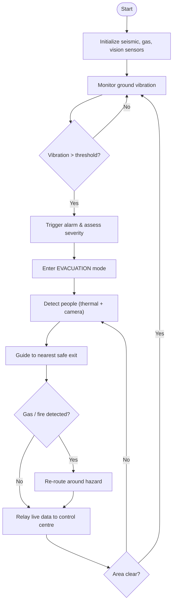
 
*Figure 2.1: Functional workflow. The vibration threshold is the master decision; inside evacuation mode a second hazard check re-routes people away from gas/fire before reporting.*
 
## Q2.3 — Control flow / state transitions
 
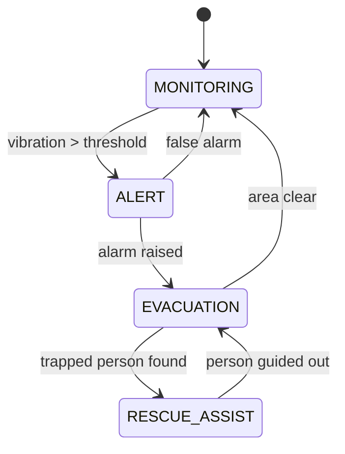
 
*Figure 2.2: State transitions. A trapped-person event diverts to RESCUE_ASSIST and returns to EVACUATION; a confirmed false alarm returns directly to MONITORING.*
 
## Q2.4 — Pseudocode
 
```text
BEGIN EarthquakeRobot
 
    INITIALIZE sensors  = {accelerometer, gasSensor, smoke, thermalCam, camera, lidar, mic, imu}
    INITIALIZE actuators = {trackMotors, siren, ledDisplay, camServo}
    SET threshold = 0.05g
    SET state = MONITORING
 
    FUNCTION readSeismic():
        a = accelerometer.readRMS(window = 1s)
        RETURN a
 
    FUNCTION triggerAlarm(severity):
        siren.on(severity)
        ledDisplay.show("EVACUATE -> EXIT")
 
    FUNCTION detectPeople():
        RETURN fuse(thermalCam.hotSpots(), camera.persons(), mic.distressSound())
 
    FUNCTION guideToExit(person):
        path = shortestPath(person.position, nearestSafeExit())
        FOR step IN path:
            avoidHazards(gasSensor, smoke)
            ledDisplay.pointTo(step)
            navigate(step)
 
    FUNCTION reportToCentre(data):
        radio.publish("emergency/feed", data)
 
    // ---------- main loop ----------
    WHILE robotIsOn():
        a = readSeismic()
        IF a > threshold THEN
            severity = estimateSeverity(a)
            triggerAlarm(severity)
            state = EVACUATION
            people = detectPeople()
            FOR p IN people:
                guideToExit(p)
            reportToCentre({severity, gasSensor.read(), smoke.read()})
        state = MONITORING
 
END
```
 
## Q2.5 — Robotics Math & Mechanics
 
**Seismic magnitude (thresholding).** Sample acceleration over a window and take RMS:
 
```
a_rms = √( (1/N) · Σ aᵢ² )
ALERT if a_rms > threshold (e.g., 0.05 g, where g = 9.81 m/s²)
Severity scales with Peak Ground Acceleration (PGA) = max|aᵢ|
```
 
**Coordinate geometry (shortest path to exit).** With exits at known coordinates, pick the nearest by Euclidean distance and route with **A\***/Dijkstra on the floor graph:
 
```
d_exit = √((x_exit − x_person)² + (y_exit − y_person)²)
choose exit = argmin(d_exit)
```
 
**Locomotion / torque on a debris slope (incline angle α):** force to climb `F = m·g·sin α`, motor torque `τ = F·r`. (Worked numerically under the Firefighting robot, which uses the same incline model.)
 
## Q2.6 — Vision Sensors: challenges & SLAM
 
**Challenges:** dust and smoke after a quake blind RGB cameras; lighting may be dark (power out); the building's geometry has **changed** (collapsed walls), so a pre-loaded map is wrong.
 
**Techniques:**
 
- **Thermal + RGB fusion** — thermal sees body heat through dust/dark to find survivors.
- **Re-mapping SLAM** — don't trust the old map; run SLAM live to rebuild the changed environment and still localize.
- **LiDAR** penetrates dust/smoke better than a camera for obstacle geometry.
**Problem-solving approach for "can't find survivors in smoke":** prioritize thermal camera + microphone (sound) over RGB → fuse hotspots with audio direction → mark candidate locations on the live SLAM map for rescuers.
 
## Q2.7 — Control Systems: feedback & PID
 
- **Threshold/bang-bang control** for the alarm (on/off at a vibration threshold).
- **PID for stable locomotion** on shaking, uneven ground: error = tilt angle from IMU; the controller adjusts track speeds to keep the robot upright and on heading. **Tuning** favours a higher Kd (strong damping) because the ground itself is vibrating — too little damping makes the robot oscillate with the tremor.
## Q2.8 — Communication Protocols
 
Infrastructure may be **damaged**, so reliability and range dominate:
 
- **LoRa / 4G-LTE** — long-range alerts to the emergency centre when Wi-Fi is down.
- **MQTT** over whatever link survives — lightweight publish of sensor feeds.
- **Zigbee / mesh** — robot-to-robot in a swarm so messages hop around dead zones.
- Use **redundant links** (try cellular, fall back to LoRa).
---
 
# 3. Robotic Arm / Manipulator
 
**Scenario:** A multi-DOF industrial arm performs pick-and-place: a camera finds a part's pose, the controller computes joint angles (IK), each joint moves under PID control to grasp the part, the arm moves it to a target location, releases, and returns home. **This is the robot for FK, IK, and torque.**
 
## Q3.1 — Embedded Systems: sensors, actuators, integration
 
**Sensors:**
 
- **Joint encoders** — measure each joint angle (the core position feedback).
- **Force/torque sensor at the wrist** — detect contact and control grip force.
- **Motor current sensors** — estimate joint torque/load.
- **Camera (eye-in-hand or fixed)** — locate the object's pose (visual servoing).
- **Limit switches** — define home/zero and protect joint limits.
- **Tactile/proximity sensor in gripper** — confirm a part is held.
**Actuators:**
 
- **Servo / stepper / BLDC motor at each joint**, usually through a **gearbox / harmonic drive** for torque.
- **Gripper actuator** (servo or pneumatic).
**Integration:** encoders → controller computes the current end-effector pose via **FK**; given a target pose, the controller solves **IK** for joint angles; a **per-joint PID** drives each motor to its target angle; the force sensor closes a grip-force loop. Closed-loop on every joint = accuracy.
 
## Q3.2 — Functionality-based workflow (flow diagram)
 
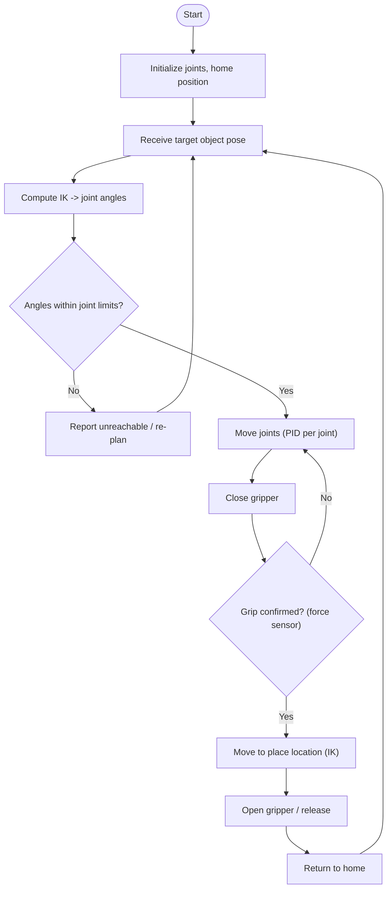
 
*Figure 3.1: Functional workflow. IK feasibility is checked against joint limits before motion, and a force-sensor check confirms the grasp before the arm transports the part.*
 
## Q3.3 — Control flow / state transitions
 
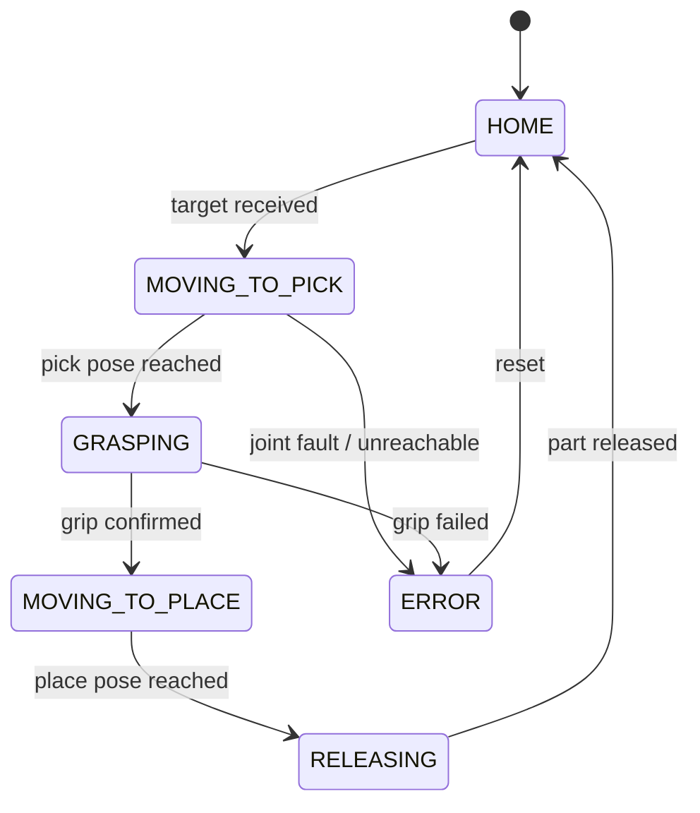
 
*Figure 3.2: State transitions including an ERROR state entered on a joint fault or failed grip, recoverable by resetting to HOME.*
 
## Q3.4 — Pseudocode
 
```text
BEGIN RoboticArm
 
    INITIALIZE joints   = {J1, J2, ... Jn}   with encoders
    INITIALIZE gripper, forceSensor, camera
    SET L1, L2 = link lengths
    moveAllJointsTo(HOME)
    SET state = HOME
 
    FUNCTION forwardKinematics(theta1, theta2):
        x = L1*cos(theta1) + L2*cos(theta1 + theta2)
        y = L1*sin(theta1) + L2*sin(theta1 + theta2)
        RETURN (x, y)
 
    FUNCTION inverseKinematics(x, y):
        c2 = (x*x + y*y - L1*L1 - L2*L2) / (2*L1*L2)
        theta2 = atan2( sqrt(1 - c2*c2), c2 )           // elbow-up
        theta1 = atan2(y, x) - atan2(L2*sin(theta2), L1 + L2*cos(theta2))
        RETURN (theta1, theta2)
 
    FUNCTION moveJointTo(joint, targetAngle):
        WHILE abs(joint.angle() - targetAngle) > tol:
            error = targetAngle - joint.angle()
            u     = PID(error)                           // position control
            joint.drive(u)
 
    FUNCTION grasp():
        gripper.close()
        WAIT until forceSensor.read() >= GRIP_FORCE
 
    // ---------- main loop ----------
    WHILE robotIsOn():
        target = camera.getObjectPose()
        (t1, t2) = inverseKinematics(target.x, target.y)
        IF withinLimits(t1, t2) THEN
            moveJointTo(J1, t1); moveJointTo(J2, t2)
            grasp()
            (p1, p2) = inverseKinematics(PLACE.x, PLACE.y)
            moveJointTo(J1, p1); moveJointTo(J2, p2)
            gripper.open()
            moveAllJointsTo(HOME)
        ELSE
            report("unreachable")
 
END
```
 
## Q3.5 — Robotics Math & Mechanics (FK, IK, Torque) — full worked answers
 
### Coordinate frames
The **base frame** is fixed. Each joint has its own frame; link 1 (length `L1`) makes angle `θ1` with the X-axis, link 2 (length `L2`) makes angle `θ2` **relative to link 1**. The end-effector sits at `(x, y)`.
 
```
                       • (x, y)  end-effector
                      /
                  L2 /
                    /  θ2  (relative angle at the elbow)
            elbow  •─────────
                  /
              L1 /
                / θ1  (measured from +X axis)
        base   •────────────────────────► X
```
 
### Forward Kinematics (2-DOF planar arm)
Given joint angles, find the end-effector position:
 
```
x = L1·cos(θ1) + L2·cos(θ1 + θ2)
y = L1·sin(θ1) + L2·sin(θ1 + θ2)
```
 
### Inverse Kinematics (2-DOF planar arm)
Given a target `(x, y)`, find the joint angles:
 
```
cos θ2 = (x² + y² − L1² − L2²) / (2·L1·L2)
θ2     = ± acos(...)            // + = elbow-down, − = elbow-up (two solutions)
θ1     = atan2(y, x) − atan2(L2·sin θ2, L1 + L2·cos θ2)
```
 
### Worked numerical example (FK ↔ IK check)
Let `L1 = L2 = 1 m`, target `(x, y) = (1, 1)`.
 
**IK:**
```
cos θ2 = (1² + 1² − 1² − 1²) / (2·1·1) = 0 / 2 = 0   →  θ2 = 90°
θ1 = atan2(1, 1) − atan2(1·sin90°, 1 + 1·cos90°)
   = 45° − atan2(1, 1) = 45° − 45° = 0°
```
**FK check (plug θ1 = 0°, θ2 = 90° back in):**
```
x = 1·cos0° + 1·cos(0°+90°) = 1 + 0 = 1 ✓
y = 1·sin0° + 1·sin(0°+90°) = 0 + 1 = 1 ✓
```
The solution is consistent — this is the standard way to verify IK in an exam.
 
### Torque calculation (holding a load)
Static torque a joint must supply to hold mass `m` at horizontal reach `r`:
 
```
τ = m · g · r
```
For a 2-link arm the shoulder reach is `r = L1·cos θ1 + L2·cos(θ1+θ2)` (plus link self-weight at their centres of mass for a fuller answer).
 
**Worked example:** payload `m = 2 kg` at reach `r = 0.5 m`, `g = 9.81`:
```
τ = 2 × 9.81 × 0.5 = 9.81 N·m
```
Add a link of mass `mL = 1 kg` whose centre is at `0.25 m`:
```
τ_total = 9.81 + (1 × 9.81 × 0.25) = 9.81 + 2.45 = 12.26 N·m
```
The shoulder motor + gearbox must deliver ≥ 12.26 N·m (apply a safety factor).
 
## Q3.6 — Vision Sensors: challenges & techniques
 
**Challenges:** specular reflections/glare off shiny metal parts, precise **6-DOF pose** estimation, camera-to-arm **calibration** (hand–eye), depth ambiguity from a single camera, partial occlusion in a bin.
 
**Techniques:**
 
- **Hand–eye (extrinsic) calibration** so pixel coordinates map correctly to the arm's base frame.
- **Stereo / depth camera** for reliable 3D pose; **fiducial markers (ArUco)** for high-accuracy pose when allowed.
- **Visual servoing** — close a control loop directly on the image error (move so the part centres in view).
- Controlled/diffuse lighting and polarizers to kill glare.
## Q3.7 — Control Systems: PID, tuning, performance
 
**Per-joint position PID:** error = (target angle − measured angle), output = motor command. `u = Kp·e + Ki·∫e dt + Kd·de/dt`.
 
- **Kp (stiffness):** larger → faster move, but too large → overshoot/oscillation.
- **Ki:** removes steady-state error — e.g., gravity making the arm **droop** below the target; the integral term builds up and holds it exactly.
- **Kd (damping):** suppresses overshoot and oscillation near the target.
**Performance metrics** (judge the step response): **rise time** (how fast it reaches the target), **overshoot** (how far it passes it), **settling time** (time to stay within a band), **steady-state error** (final offset).
 
**Tuning — Ziegler–Nichols:** set Ki = Kd = 0, raise Kp until the output **oscillates steadily** at gain `Ku` with period `Tu`, then set `Kp = 0.6·Ku`, `Ki = 1.2·Ku/Tu`, `Kd = 0.075·Ku·Tu`. Practical rule: Kp for speed → Kd to remove overshoot → Ki to remove residual error.
 
## Q3.8 — Communication Protocols
 
Joint control must be **deterministic and low-latency**:
 
- **CAN bus** — robust multi-drop bus to all joint drivers (industry standard).
- **EtherCAT** — hard real-time Ethernet for high-performance synchronized joints.
- **Modbus / RS-485** — integration with PLCs and simpler drives.
---
 
# 4. Nursing Assistant Robot
 
**Scenario:** A hospital robot delivers medication/supplies to patients. It navigates corridors crowded with moving people, verifies the patient's identity before dispensing, checks basic vitals, responds to voice calls, and returns to base — all while guaranteeing safety around humans.
 
## Q4.1 — Embedded Systems: sensors, actuators, integration
 
**Sensors:**
 
- **LiDAR + RGB-D camera** — navigation, people detection, SLAM in the ward.
- **Ultrasonic / IR proximity** — safety bubble: stop if a person is too close.
- **RFID/NFC reader** — verify patient ID and match it to the correct medication.
- **IR thermometer / SpO₂ / BP module** — basic vitals.
- **Microphone + touchscreen** — voice/UI interaction and patient calls.
- **Load cell** — confirm the correct tray payload.
**Actuators:**
 
- **Differential-drive motors** — smooth mobility.
- **Optional small arm/gripper** — hands items to the patient.
- **Speaker + display** — communication.
- **Linear actuator** — adjustable tray height.
**Integration:** the navigation stack fuses **LiDAR + IMU + encoders**; a **safety layer** lets proximity sensors override motion (emergency stop) regardless of what the planner wants; RFID ties identity verification to the dispensing actuator so meds can't be released to the wrong patient.
 
## Q4.2 — Functionality-based workflow (flow diagram)
 
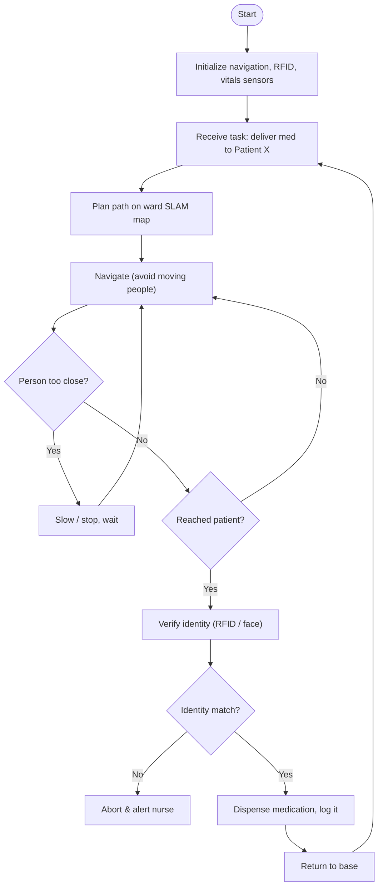
 
*Figure 4.1: Functional workflow. A proximity check runs continuously during navigation (safety first), and dispensing only happens after a successful identity match — otherwise it aborts and alerts staff.*
 
## Q4.3 — Control flow / state transitions
 
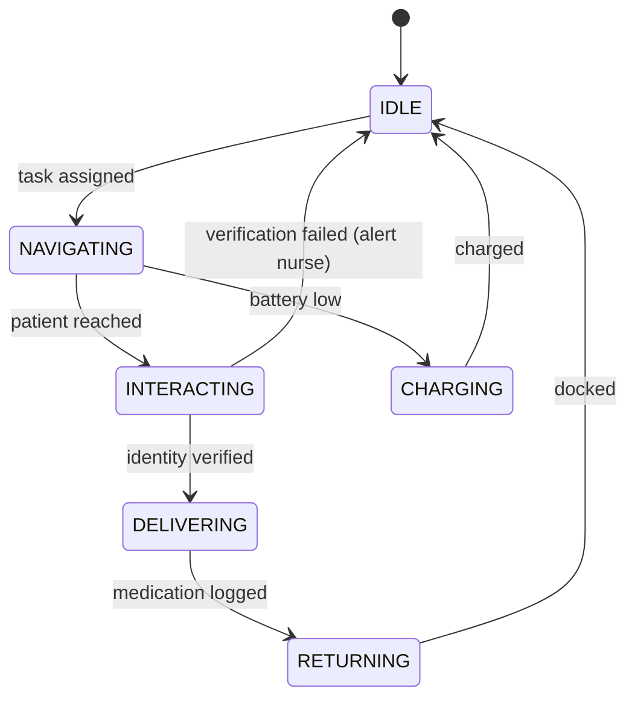
 
*Figure 4.2: State transitions. Failed verification returns the robot to IDLE after alerting a nurse; low battery diverts to CHARGING.*
 
## Q4.4 — Pseudocode
 
```text
BEGIN NursingAssistantRobot
 
    INITIALIZE sensors  = {lidar, rgbdCamera, ultrasonic, rfid, thermometer, mic, loadCell}
    INITIALIZE actuators = {driveMotors, gripper, speaker, display, trayActuator}
    SET safeDistance = 1.0    // metres
    SET state = IDLE
 
    FUNCTION planPath(goal):
        RETURN aStar(slamMap, currentPose, goal)
 
    FUNCTION navigate(path):
        FOR waypoint IN path:
            WHILE distanceTo(waypoint) > tol:
                IF nearestPerson() < safeDistance THEN
                    driveMotors.stop()          // safety override
                ELSE
                    error = headingError(waypoint)
                    speed = PID(error)
                    driveMotors.set(limit(speed, SMOOTH_MAX))
 
    FUNCTION verifyPatient(expectedID):
        RETURN rfid.read() == expectedID
 
    FUNCTION dispense(med):
        trayActuator.present(med)
        log(patient, med, timestamp)
 
    // ---------- main loop ----------
    WHILE robotIsOn():
        task = getTaskFromNurseStation()        // via MQTT
        path = planPath(task.patientLocation)
        navigate(path)
        IF verifyPatient(task.patientID) THEN
            dispense(task.medication)
        ELSE
            alertNurse("ID mismatch")
        navigate( planPath(BASE) )
 
END
```
 
## Q4.5 — Robotics Math & Mechanics
 
**Mobile-robot kinematics** (same differential-drive equations as the garbage robot): `v=(vR+vL)/2`, `ω=(vR−vL)/L`, `ẋ=v cosθ`, `ẏ=v sinθ`.
 
**Safe stopping distance (a safety calculation examiners love).** To stop before hitting a person, given speed `v` and braking deceleration `a`:
 
```
d_stop = v² / (2·a)
Example: v = 1 m/s, a = 0.5 m/s²
d_stop = 1² / (2 × 0.5) = 1 m
```
So the proximity "safe bubble" must be at least 1 m at 1 m/s. Slower speed near patients → smaller bubble needed.
 
**Coordinate geometry / path length** between waypoints: `d = √(Δx² + Δy²)`; total route = Σ segment lengths (used to pick the shortest plan from A\*).
 
If the robot hands an item with a 2-link arm, reuse the **FK/IK** equations from the Robotic Arm section.
 
## Q4.6 — Vision Sensors: challenges & SLAM
 
**Challenges:** the environment is **dynamic** — people constantly move (the hardest case for a static map); glossy/reflective hospital floors confuse LiDAR; **glass doors** are invisible to LiDAR; low-light corridors at night; **privacy** concerns with face recognition.
 
**Techniques:**
 
- **Dynamic SLAM** — separate moving people from the static map so the map stays clean.
- **Pedestrian detection + tracking** with motion prediction → **social navigation** (predict where people will walk and go around politely).
- **Multi-sensor fusion** (LiDAR + depth camera + ultrasonic) to catch glass/reflective surfaces.
- Privacy-preserving ID (RFID wristband instead of face) where possible.
**Problem-solving approach for "robot freezes in a crowd":** predict pedestrian trajectories, plan a path through gaps, reduce speed instead of full-stopping, and allow gentle re-planning so it keeps making progress safely.
 
## Q4.7 — Control Systems: feedback & PID
 
- **Heading + velocity PID**, but tuned for **comfort and safety**: limit acceleration (smooth profiles, no jerky motion near patients), modest Kp so motion is gentle, Kd to avoid oscillation.
- A **hard safety layer** above PID: proximity sensor → emergency stop, overriding the controller. This is *safety-critical* control — the stop is not negotiable.
## Q4.8 — Communication Protocols
 
- **Wi-Fi** to the hospital network and the electronic health record (EHR) system.
- **MQTT** to receive tasks from the nurse station and report completion.
- **Bluetooth/BLE** to patient wearables for vitals.
- **Security:** patient data must be **encrypted** (TLS) and access-controlled — health data is sensitive.
---
 
# 5. Firefighting Robot
 
**Scenario:** A tracked robot patrols a facility, detects fire via flame and thermal sensors, navigates toward the source through smoke while avoiding obstacles, stops at a safe distance, aims a nozzle at the fire, and sprays water/foam until the fire is out — reporting to firefighters throughout.
 
## Q5.1 — Embedded Systems: sensors, actuators, integration
 
**Sensors:**
 
- **IR flame sensors (several, angled)** — detect fire direction.
- **Thermal/IR camera** — "see" the fire and victims through smoke; locate the hottest region.
- **Temperature sensor (thermopile/thermocouple)** — heat level / safe-distance check.
- **Smoke + combustible-gas sensor (MQ-2)** — confirm fire, detect explosion risk.
- **LiDAR / ultrasonic** — navigation in low visibility.
- **IMU** — orientation on stairs/debris.
**Actuators:**
 
- **Tracked drive motors** (heat/debris resistant) — locomotion.
- **Water pump + solenoid valve** — control water/foam flow.
- **Pan/tilt nozzle servos** — aim the jet at the fire.
**Integration:** flame sensors give a coarse direction → the robot drives toward it → the **thermal camera** confirms and gives the fire's centroid → **pan/tilt servos** aim the nozzle at that centroid (a closed loop on the thermal image) → the **temperature sensor** enforces a minimum safe standoff distance. Sensor fusion (flame + thermal + temperature) makes targeting robust in smoke.
 
## Q5.2 — Functionality-based workflow (flow diagram)
 
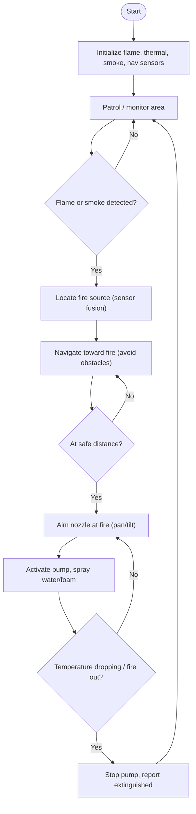
 
*Figure 5.1: Functional workflow. A safe-distance check gates spraying, and the fire-out check (temperature dropping) loops back to re-aim and keep spraying until the fire is confirmed out.*
 
## Q5.3 — Control flow / state transitions
 
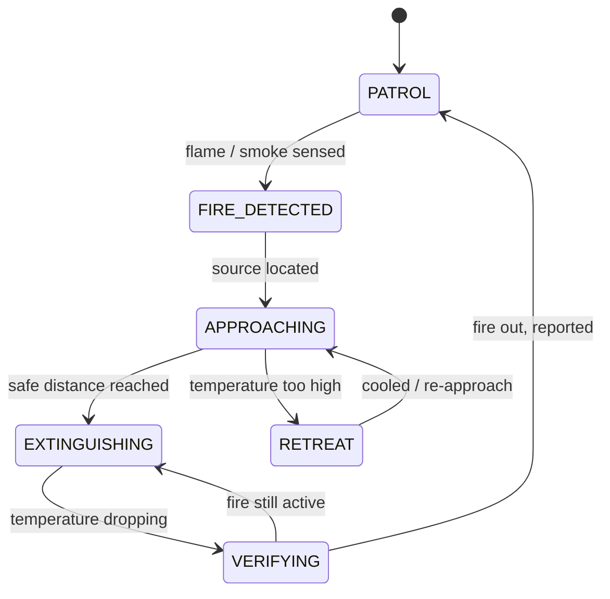
 
*Figure 5.2: State transitions. A RETREAT state protects the robot when heat is excessive, and VERIFYING loops back to EXTINGUISHING until the fire is confirmed out.*
 
## Q5.4 — Pseudocode
 
```text
BEGIN FirefightingRobot
 
    INITIALIZE sensors  = {flameSensorL, flameSensorR, thermalCam, tempSensor, smoke, lidar, imu}
    INITIALIZE actuators = {trackMotors, pump, valve, panServo, tiltServo}
    SET safeTemp = 60      // deg C standoff limit
    SET state = PATROL
 
    FUNCTION fireDetected():
        RETURN flameSensorL.read() OR flameSensorR.read() OR smoke.read() > limit
 
    FUNCTION fireDirection():
        // like line-following: steer toward the stronger flame reading
        RETURN flameSensorR.read() - flameSensorL.read()
 
    FUNCTION approachFire():
        WHILE not atSafeDistance():
            avoidObstacles(lidar)
            error = fireDirection()
            trackMotors.steer( PID(error) )
            IF tempSensor.read() > safeTemp THEN RETREAT()
 
    FUNCTION aimNozzle():
        centroid = thermalCam.hottestRegion()
        panServo.move(  PID(centroid.x - frameCenter.x) )
        tiltServo.move( PID(centroid.y - frameCenter.y) )
 
    FUNCTION spray():
        valve.open(); pump.on()
 
    // ---------- main loop ----------
    WHILE robotIsOn():
        IF fireDetected() THEN
            approachFire()
            WHILE not fireIsOut():
                aimNozzle()
                spray()
            pump.off(); valve.close()
            report("fire extinguished")
 
END
```
 
## Q5.5 — Robotics Math & Mechanics
 
**Flame direction (triangulation, line-follower style).** Two flame sensors, readings `sL, sR` (higher = closer/stronger):
 
```
error = sR − sL
error > 0  →  fire is to the right → steer right
error < 0  →  fire is to the left  → steer left
error ≈ 0  →  fire is straight ahead
```
This error feeds the steering PID (exactly your line-follower logic).
 
**Nozzle aiming (projectile range).** To land water at horizontal distance `R` (level target), at jet speed `v`:
 
```
R = v² · sin(2θ) / g     →     θ = ½ · arcsin( R·g / v² )
Example: R = 4 m, v = 8 m/s, g = 9.81
sin(2θ) = (4 × 9.81) / 8² = 39.24 / 64 = 0.613
2θ = 37.8°  →  θ ≈ 18.9°
```
(If the fire is at height `h`, add a height-correction term to the projectile equation.)
 
**Torque to climb a slope/stairs (tracked drive, incline α).**
 
```
Tractive force:  F = m·g·sin α + μ·m·g·cos α     (μ = rolling resistance)
Motor torque:    τ = F · r                        (r = sprocket radius)
Example (ignore μ): m = 20 kg, α = 20°, r = 0.1 m, g = 9.81
F = 20 × 9.81 × sin20° = 20 × 9.81 × 0.342 = 67.1 N
τ = 67.1 × 0.1 = 6.71 N·m  per drive
```
 
## Q5.6 — Vision Sensors: challenges & techniques
 
**Challenges:** **smoke blinds ordinary cameras**; flame glare saturates the RGB image; heat-haze distorts the picture; the robot must tell **fire** apart from a **victim** to know where to spray vs whom to rescue; the environment changes as things burn/collapse (map drifts).
 
**Techniques:**
 
- **Thermal/IR imaging** is the primary sensor — it sees heat through smoke and gives the fire's location directly.
- **LiDAR** for navigation geometry (penetrates smoke far better than a camera).
- **Thermal + LiDAR fusion** for "where is the fire, and what's in the way".
- **SLAM** re-run live because the burning environment is changing.
**Problem-solving approach for "camera sees only smoke":** drop the RGB camera for targeting, rely on thermal centroid for aiming and LiDAR for obstacle avoidance; sanity-check the thermal hotspot against the flame sensors before spraying.
 
## Q5.7 — Control Systems: feedback & PID
 
Three feedback loops:
 
1. **Heading PID** — drives toward the fire; error = flame-sensor difference (`sR − sL`).
2. **Nozzle-aim PID** — keeps the nozzle locked on the fire centroid; error = (hotspot pixel − image centre). Pan and tilt each get a PID.
3. **Safe-distance / temperature loop** — if `temp > safeTemp`, back off (RETREAT).
**Tuning:** fire is urgent, so the heading loop wants a **fast response** (higher Kp), but the nozzle-aim loop needs **stability** (more Kd) so the jet doesn't jitter off-target. This is the classic speed-vs-stability trade-off.
 
## Q5.8 — Communication Protocols
 
- **RF / Wi-Fi** — teleoperation by firefighters with a **live video feed** (low latency for control).
- **LoRa** — long-range link inside large buildings where Wi-Fi can't reach.
- **Mesh (Zigbee)** — multi-robot coordination so units relay through each other.
- Reliability and low latency dominate — a dropped command in a fire is dangerous.
---
 
# Quick-Revision Cheat Sheet
 
## Key formulas
 
**Mobile robot (differential drive)**
```
v = (vR + vL)/2 ,  ω = (vR − vL)/L
ẋ = v·cosθ ,  ẏ = v·sinθ ,  θ̇ = ω
heading to target:  θ_t = atan2(yt−yr, xt−xr)
distance:           d   = √((xt−xr)² + (yt−yr)²)
```
 
**2-DOF arm — Forward Kinematics**
```
x = L1·cosθ1 + L2·cos(θ1+θ2)
y = L1·sinθ1 + L2·sin(θ1+θ2)
```
 
**2-DOF arm — Inverse Kinematics**
```
cosθ2 = (x² + y² − L1² − L2²)/(2·L1·L2)
θ2 = ±acos(cosθ2)          (± = elbow up/down, 2 solutions)
θ1 = atan2(y,x) − atan2(L2·sinθ2, L1 + L2·cosθ2)
```
 
**Torque (static, hold load)**
```
τ = m·g·r           (r = horizontal reach)   [add link self-weight at L/2 for full marks]
```
 
**PID**
```
u(t) = Kp·e + Ki·∫e dt + Kd·de/dt
P → speed/strength   I → kill steady-state error   D → damp overshoot
```
 
**Safety / projectile / incline**
```
stopping distance: d = v²/(2a)
projectile range:  R = v²·sin(2θ)/g
incline force:     F = m·g·sinα (+ μ·m·g·cosα)  ;  τ = F·r
seismic alert:     a_rms = √((1/N)Σaᵢ²) > threshold (e.g. 0.05g)
```
 
## Sensor summary
 
| Sensor | Measures | Typical robot use |
|---|---|---|
| Ultrasonic (HC-SR04) | Distance (short) | Obstacle avoidance |
| LiDAR | 2D/3D range map | SLAM, navigation |
| RGB / RGB-D camera | Image / depth | Detection, pose, vision |
| Thermal / IR camera | Heat | Fire & survivor detection in smoke |
| IR flame sensor | Flame presence/direction | Firefighting targeting |
| IMU (accel + gyro) | Orientation, motion | Stability, odometry |
| Encoder | Wheel/joint rotation | Speed & position feedback |
| Force/torque sensor | Contact force | Grip control (arm) |
| Gas sensor (MQ-2/MQ-7) | Combustible gas / CO | Earthquake, firefighting |
| Accelerometer/geophone | Vibration | Seismic detection |
| RFID/NFC | Identity tag | Patient/medication ID |
| Load cell | Weight | Bin-full / payload check |
 
## Communication protocol summary
 
| Protocol | Type | Speed/range | Best for |
|---|---|---|---|
| I²C | Wired, 2-wire bus | Low, on-board | Low-rate sensors (IMU) |
| SPI | Wired, fast | High, on-board | High-rate sensors (LiDAR) |
| UART | Wired, point-to-point | Medium | MCU↔SBC, GPS |
| CAN bus | Wired, multi-drop | Robust, real-time | Joint/motor control |
| EtherCAT | Wired Ethernet | Hard real-time | Synchronized arm joints |
| Modbus/RS-485 | Wired, multi-drop | Medium | PLC / industrial |
| Wi-Fi | Wireless | High, ~tens of m | Dashboards, video, EHR |
| Bluetooth/BLE | Wireless | Low, short | Wearables, vitals |
| Zigbee | Wireless mesh | Low, mesh | Robot swarm relay |
| LoRa | Wireless | Very low rate, km range | Disaster / long-range alerts |
| MQTT | App-layer (over Wi-Fi/cellular) | Lightweight pub/sub | Telemetry, task assignment |
 
## PID tuning (Ziegler–Nichols, quick)
1. Ki = Kd = 0; raise Kp until steady oscillation at gain `Ku`, period `Tu`.
2. `Kp = 0.6·Ku`, `Ki = 1.2·Ku/Tu`, `Kd = 0.075·Ku·Tu`.
3. Judge with: **rise time, overshoot, settling time, steady-state error.**
---
 
### One-line memory hooks
- **Garbage** → vision + SLAM + gripper torque.
- **Earthquake** → accelerometer threshold + LoRa + re-mapping SLAM.
- **Arm** → FK/IK/torque + CAN/EtherCAT + per-joint PID.
- **Nursing** → dynamic SLAM + stopping distance + safety override + encryption.
- **Firefighting** → thermal camera + flame triangulation + nozzle-aim PID + RETREAT on heat.
 
