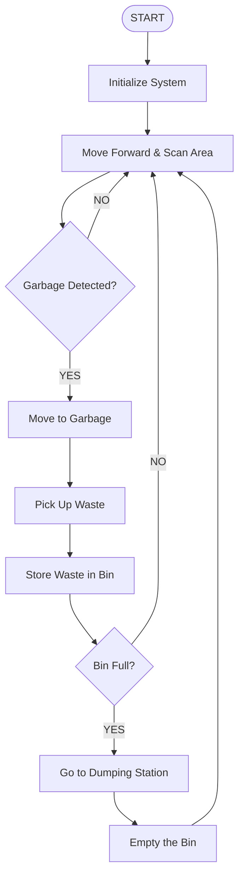
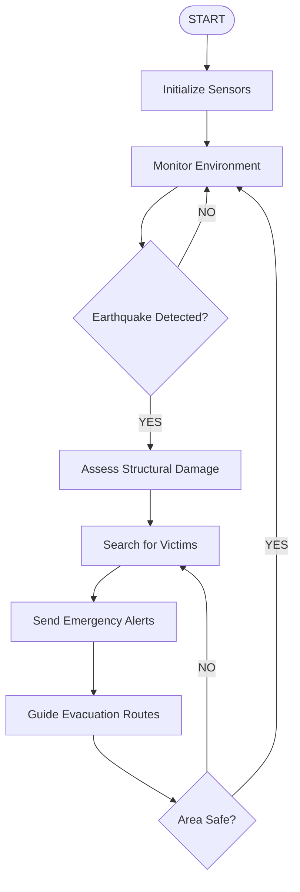
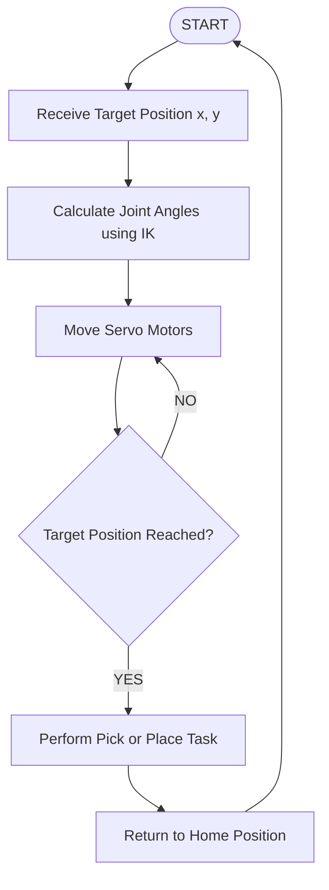
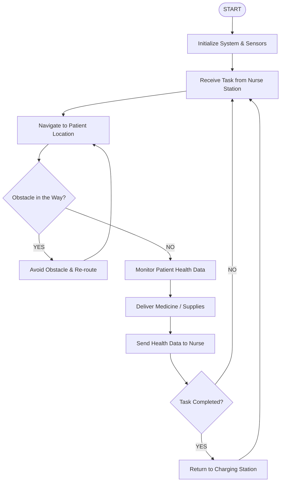
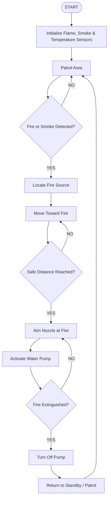

# 🤖 Robotics — Final Notes
### 5 Robots | Easy Language | Clean Diagrams

---

# 🗑️ 1. Garbage Collection Robot

## Purpose
A **Garbage Collection Robot** automatically detects, picks up, and disposes of waste.
It works in roads, parks, factories, or indoor spaces — without needing a human to operate it.

## Design Overview
The robot moves around an area, spots garbage using sensors or a camera,
grabs it with a robotic arm or gripper, and stores it in a bin.
When the bin is full, it goes to a dumping station and empties itself.

## Challenges
- Identifying different types of garbage correctly
- Limited battery life
- Moving in crowded places without hitting things
- Picking up objects of different shapes and sizes

## Applications
- Smart cities
- Industrial cleaning
- Public parks
- Hospitals & Airports

## Main Components

| Component | What it does |
|---|---|
| Microcontroller (Arduino/ESP32) | The brain — controls everything |
| Ultrasonic Sensor | Detects obstacles nearby |
| Camera | Identifies and locates garbage |
| Robotic Arm / Gripper | Picks up the waste |
| Servo Motor | Moves the arm |
| DC Motors | Makes the robot move |
| Battery | Gives power |
| Waste Storage Bin | Stores the collected garbage |

## Working Principle
1. Robot starts patrolling the area.
2. Sensors scan for garbage.
3. Garbage is detected.
4. Robotic arm moves toward the object.
5. Garbage is picked up and placed in the bin.
6. If the bin is full → go to the dumping station and empty it.
7. Robot continues searching.

## Workflow Diagram

The robot keeps scanning until it finds garbage. After storing the waste, it checks if the bin is full. If yes, it goes to dump. If no, it continues searching.


*Figure 1.1: Workflow of the Garbage Collection Robot. The robot loops between scanning and collecting. When the bin is full, it empties itself and resumes.*

## Pseudocode

```
START

  Initialize Sensors
  Initialize Motors
  Initialize Robotic Arm

  WHILE robot is active:

    Scan Environment

    IF garbage detected THEN
      Move to Garbage
      Pick Up Garbage
      Store in Bin
    END IF

    IF bin is full THEN
      Move to Disposal Area
      Empty Bin
    END IF

  END WHILE

STOP
```

---

# 🌍 2. Earthquake Monitoring & Evacuation Robot

## Purpose
This robot detects earthquake hazards, monitors damage to buildings,
and helps people evacuate safely from dangerous areas.

## Design Overview
The robot enters areas that are too dangerous for humans.
It collects real-time data about vibrations, gas leaks, fire risks,
and trapped victims — and sends this information to emergency teams.

## Challenges
- Communication can fail after an earthquake
- Dust and debris can block sensors
- Ground may be unstable and hard to navigate
- Limited battery life

## Applications
- Disaster response & rescue missions
- Building safety inspection
- Emergency management

## Main Components

| Component | What it does |
|---|---|
| Accelerometer | Detects vibration from shaking |
| Seismic Sensor | Measures earthquake strength |
| Gas Sensor | Detects dangerous gas leaks |
| Temperature Sensor | Detects fire or extreme heat |
| Camera | Monitors the area live |
| GPS Module | Tracks robot location |
| Wireless Module | Sends data to rescue teams |
| Motors | Makes the robot move |

## Working Principle
1. Robot continuously monitors the environment.
2. Detects unusual vibrations or shaking.
3. Checks for structural damage.
4. Searches for trapped victims.
5. Sends emergency alerts to the control center.
6. Guides people toward safe exit routes.

## Workflow Diagram

The robot keeps monitoring. When it detects an earthquake, it switches into emergency mode — assesses damage, finds victims, sends alerts, and guides evacuation.


*Figure 2.1: Workflow of the Earthquake Monitoring & Evacuation Robot. The robot monitors in a loop. On detecting a quake, it enters emergency mode and only returns to monitoring once the area is safe.*

## Pseudocode

```
START

  Initialize Sensors

  WHILE active:

    Read Seismic Data

    IF earthquake detected THEN
      Assess Structural Damage
      Search for Victims
      Send Alert to Control Center
      Guide Evacuation
    END IF

  END WHILE

STOP
```

---

# 🦾 3. Robotic Arm / Robotic Manipulator

## Purpose
A robotic arm is used to **grip, move, rotate, and place objects** with high accuracy.
It replaces human hands in tasks that are repetitive, dangerous, or need precision.

## Design Overview
It is made of multiple **joints** (like shoulder, elbow, wrist) and **links** (like bones)
that work together — just like a human arm. The end of the arm has a **gripper** or tool.

## Main Components

| Component | What it does |
|---|---|
| Base | Supports the whole arm, stays fixed |
| Links | Connect the joints (like bones) |
| Joints | Allow movement at each connection point |
| Servo Motors | Power each joint |
| End Effector | The gripper or tool at the tip |
| Controller | Sends commands to joints |
| Sensors / Encoders | Feedback — tells controller where each joint is |

## Working Principle
1. Receive the target object's coordinates `(x, y)`.
2. Calculate the required **joint angles** using **Inverse Kinematics (IK)**.
3. Move each joint using servo motors.
4. Reach the target position.
5. Pick or place the object.
6. Return to the home (starting) position.

> 💡 **IK (Inverse Kinematics):** Given *where* you want the arm to go, calculate *which angles* each joint needs to be at. It is the reverse of FK (Forward Kinematics), which asks: given the joint angles, *where* is the tip?

## Workflow Diagram

The arm receives a target, computes IK, moves joints, performs the task, and returns home — ready for the next command.


*Figure 3.1: Workflow of the Robotic Arm. After each task, the arm returns to the home position and waits for the next target.*

## Pseudocode

```
START

  Receive Target Coordinates (x, y)
  Calculate Joint Angles using Inverse Kinematics
  Move Servo Motors to Calculated Angles

  IF target reached THEN
    Perform Pick / Place Task
  END IF

  Return to Home Position

STOP
```

---

# 🏥 4. Nursing Assistant Robot

## Purpose
A **Nursing Assistant Robot** helps hospital staff by delivering medicines,
monitoring patient health, and transporting supplies automatically.

## Design Overview
The robot works in hospitals, clinics, and elderly care centers.
It can move on its own, talk to patients, and help with routine medical tasks —
so nurses can focus on more important work.

## Challenges
- Protecting patient privacy and data security
- Navigating accurately in crowded hospital corridors
- Reliable communication with hospital systems
- Handling emergency situations
- Battery limitations

## Applications
- Hospitals
- Elderly care centers
- Rehabilitation facilities
- Home healthcare services

## Main Components

| Component | What it does |
|---|---|
| Microcontroller / Processor | Controls all robot operations |
| Camera | Monitors patients and navigation |
| Temperature Sensor | Measures body temperature |
| Heart Rate Sensor | Monitors patient pulse |
| Ultrasonic Sensor | Detects nearby obstacles safely |
| Touchscreen / Display | Lets patients or nurses interact with it |
| Speaker & Microphone | Voice communication |
| DC Motors | Movement |
| Wi-Fi Module | Communicates with hospital network |
| Battery | Power supply |

## Working Principle
1. Robot receives a task from hospital staff (e.g., deliver medicine to Room 5).
2. Navigates to the patient's room safely.
3. Monitors patient health (temperature, heart rate).
4. Delivers medicine or supplies.
5. Sends health data to the nurse's station.
6. Returns to the charging station when done or when battery is low.

## Workflow Diagram

The robot receives a task, goes to the patient, checks health, delivers items, reports, and returns. It keeps running in a loop until it needs to charge.


*Figure 4.1: Workflow of the Nursing Assistant Robot. An obstacle check is included during navigation to ensure safe movement around patients and staff.*

## Pseudocode

```
START

  Initialize Sensors
  Initialize Communication Module

  WHILE robot is active:

    Receive Task
    Navigate to Patient

    Monitor Health Status
    Deliver Medicine
    Send Data to Nurse

    IF battery low THEN
      Go to Charging Station
    END IF

  END WHILE

STOP
```

---

# 🔥 5. Firefighting Robot

## Purpose
A **Firefighting Robot** detects fire, moves toward it,
and puts it out — in places too dangerous for human firefighters.

## Design Overview
The robot patrols an area. When it detects a flame or smoke,
it locates the fire source, drives toward it, aims a water nozzle at the fire,
and sprays water or foam until the fire is out.

## Main Components

| Component | What it does |
|---|---|
| Flame Sensor | Detects the presence and direction of fire |
| Smoke Sensor | Detects smoke (early fire warning) |
| Temperature Sensor | Measures heat level |
| Ultrasonic Sensor | Avoids obstacles while moving |
| Water Pump | Sprays water at the fire |
| Water Tank | Stores the water or foam agent |
| Servo Motor | Aims the nozzle toward the fire |
| DC Motors | Makes the robot move |
| Microcontroller | Controls all operations |
| Battery | Power source |

## Working Principle
1. Robot continuously patrols and monitors the area.
2. Flame or smoke is detected.
3. Robot calculates the direction of the fire.
4. Moves toward the fire while avoiding obstacles.
5. Activates the water pump and aims the nozzle.
6. Sprays water until the fire is extinguished.
7. Confirms fire is out and returns to standby/patrol mode.

## Workflow Diagram

The robot patrols in a loop. On detecting fire, it approaches and sprays until the fire is out, then returns to patrol mode.


*Figure 5.1: Workflow of the Firefighting Robot. After reaching a safe distance, the robot aims and sprays in a loop until the fire is confirmed out. It then returns to patrol mode.*

## Pseudocode

```
START

  Initialize Flame Sensor
  Initialize Smoke Sensor
  Initialize Motors
  Initialize Water Pump

  WHILE robot is active:

    Detect Fire

    IF fire detected THEN
      Locate Fire Position
      Move Toward Fire
      Aim Nozzle at Fire
      Activate Pump

      WHILE fire exists:
        Continue Spraying
      END WHILE

      Turn Off Pump
      Return to Standby
    END IF

  END WHILE

STOP
```

---

## 📝 Quick Summary Table

| Robot | Main Sensors | Main Actuators | Key Feature |
|---|---|---|---|
| 🗑️ Garbage | Camera, Ultrasonic | Motors, Gripper, Arm | Detects & picks litter |
| 🌍 Earthquake | Accelerometer, Gas, Camera | Motors, Speaker, Siren | Detects tremors, guides escape |
| 🦾 Robotic Arm | Encoders, Camera | Servo Motors, Gripper | FK / IK joint control |
| 🏥 Nursing | Camera, Heart Rate, Temp | Motors, Speaker, Screen | Delivers meds, monitors vitals |
| 🔥 Firefighting | Flame, Smoke, Temp | Motors, Pump, Nozzle Servo | Detects & extinguishes fire |

---

> **Exam tip:** For every robot, the examiner usually asks:
> 1. What sensors does it use and *why* that sensor?
> 2. Draw the workflow (use proper YES/NO labels on arrows).
> 3. Write pseudocode with START → INITIALIZE → functions → WHILE loop → STOP.
